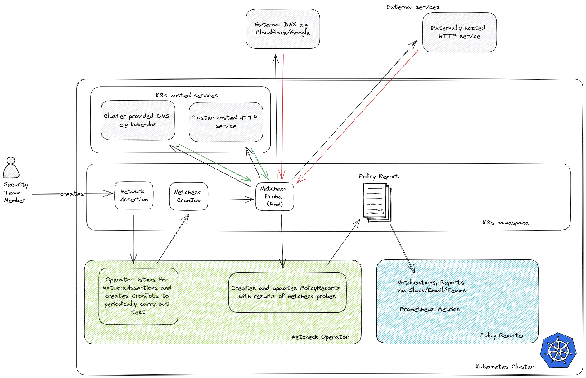

# Netchecks Operator

The **Netchecks Operator** provides a cloud native way to dynamically declare a set of statements about 
the network (what should work and what shouldn't).


## High Level Diagram



## Example


```yaml
apiVersion: netchecks.io/v1
kind: NetworkAssertion
metadata:
  name: http-k8s-api-should-work
  namespace: default
  annotations:
    description: Assert pod can connect to k8s API
spec:
  template:
    metadata:
      labels:
        optional-label: applied-to-test-pod
  schedule: "@hourly"
  rules:
    - name: kubernetes-version
      type: http
      url: https://kubernetes/version
      verify-tls-cert: false
      expected: pass
      validate:
        message: Http request to Kubernetes API should succeed.
```

`PolicyReport` resources will be created in the same namespace as the `NetworkAssertion`, e.g:

```yaml
apiVersion: wgpolicyk8s.io/v1alpha2
kind: PolicyReport
metadata:
  annotations:
    category: Network
    created-by: netcheck
    netcheck-operator-version: 0.1.0
  creationTimestamp: '2023-01-08T04:14:07Z'
  generation: 2
  labels:
    app.kubernetes.io/component: probe
    app.kubernetes.io/instance: http-should-work
    app.kubernetes.io/name: netcheck
    job-name: http-should-work-manual-w7e1x
    optional-label: applied-to-test-pod
    policy.kubernetes.io/engine: netcheck
  name: http-should-work
  namespace: default
results:
  - category: http
    message: Rule from kubernetes-version
    policy: kubernetes-version
    properties:
      data: >-
        {"startTimestamp": "2023-01-08T04:20:52.433681", "status-code": 200,
        "endTimestamp": "2023-01-08T04:20:52.441192"}
      spec: >-
        {"type": "http", "shouldFail": false, "timeout": null,
        "verify-tls-cert": false, "method": "get", "url":
        "https://kubernetes/version"}
    result: pass
    rule: kubernetes-version-rule-1
    source: netcheck
    timestamp:
      nanos: 0
      seconds: 1673151652
summary:
  pass: 1
```

For more examples see the [examples folder](examples/)


## Installation

The PolicyReport CRD is required to be installed before the operator. The CRD can be installed by running:

```shell 
kubectl apply -f https://github.com/kubernetes-sigs/wg-policy-prototypes/raw/master/policy-report/crd/v1alpha2/wgpolicyk8s.io_policyreports.yaml
```


### Helm

The helm chart is available on [Artifact Hub](https://artifacthub.io/packages/helm/netchecks/netchecks/). To install the operator

```shell
helm repo add netchecks https://hardbyte.github.io/netchecks
helm upgrade --install netchecks netchecks/netchecks -n netchecks --create-namespace
```


### Static Manifests

Alternatively, install the NetworkAssertion and PolicyReport CRDs and the Netchecks operator with:

```shell
kubectl apply -f https://github.com/hardbyte/netchecks/raw/main/operator/manifests/deploy.yaml
```

Then apply your `NetworkAssertions` as any other resource.


## Development


### Generate the static manifests (manually)

```shell
./create-static-manifests.sh
```

### Start a test cluster

If using [kind](https://kind.sigs.k8s.io/)

```shell
kind create cluster
kubectl config use-context kind-kind
```

Either manually apply the CRDs, or install then uninstall via HELM:

Manual CRD installation:

```shell
kubectl apply -f charts/netchecks/crds
```

### Start the operator outside of Kubernetes

```shell
poetry install
poetry run kopf run netchecks_operator/main.py --liveness=http://0.0.0.0:8080/healthz
```

### Building and loading a local probe Docker container

```shell

kind load docker-image ghcr.io/hardbyte/netchecks:local
```

### Create a NetworkAssertion

```shell
kubectl apply -f examples/default-k8s/http.yaml
```

### Run integration tests

```shell
pytest
```
