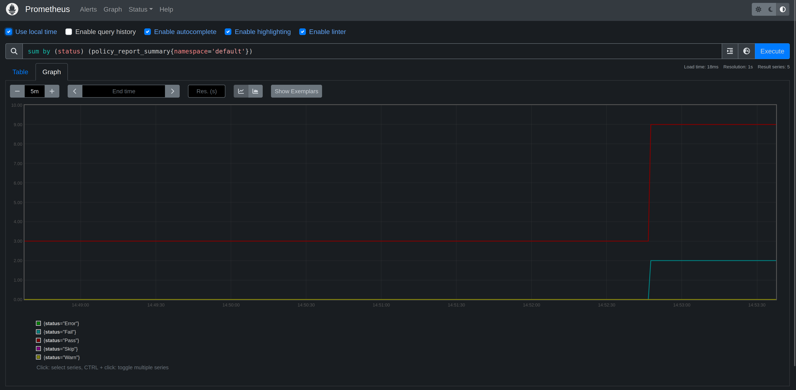
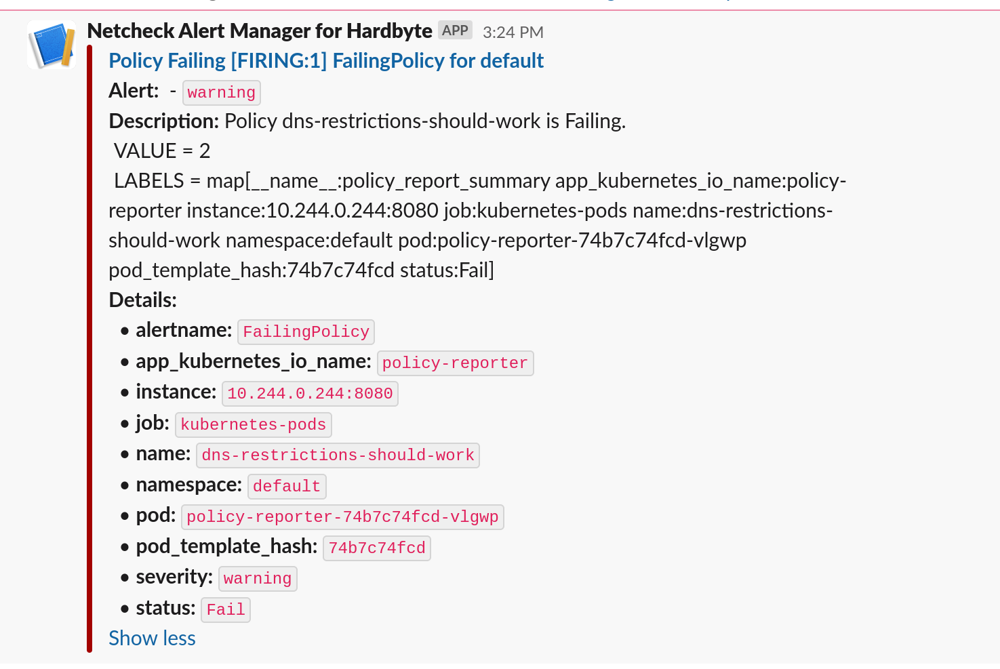

This example deploys the Kyverno Policy Reporter to demonstrate the metrics and alerting
capabilities.

See https://kyverno.github.io/policy-reporter/ for detailed configuration of Policy Reporter.

## Install the Policy Reporter

```shell
# Create the policy-reporter namespace if it doesn't exist
kubectl create namespace policy-reporter
kubectl apply -f https://github.com/kyverno/policy-reporter/raw/main/manifest/policy-reporter/install.yaml
```

## Install Prometheus and Grafana

### Add the helm repository for Prometheus and Grafana

```shell
helm repo add prometheus-community https://prometheus-community.github.io/helm-charts
helm repo add grafana https://grafana.github.io/helm-charts
helm repo update
```

### Install Prometheus

From the root directory of this repository

```shell
helm upgrade --install prometheus operator/prometheus-community/prometheus --values examples/policy-reporter/prometheus-values.yaml
```

### Access Prometheus UI

```shell
export POD_NAME=$(kubectl get pods --namespace default -l "app=prometheus,component=server" -o jsonpath="{.items[0].metadata.name}")
kubectl --namespace default port-forward $POD_NAME 9090
```

### Explore the Policy Reporter metrics

For example show the results by status:

`sum by (status) (policy_report_summary{namespace='default'})`




## Alert Manager


